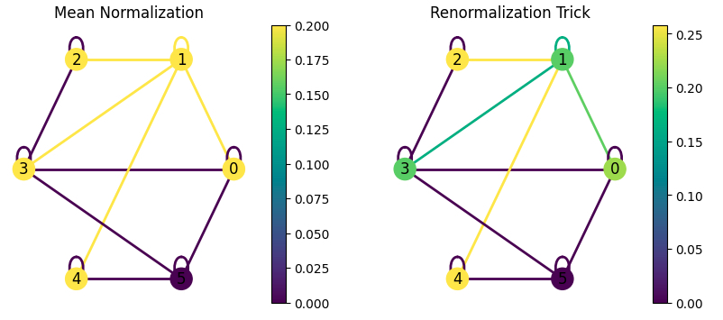
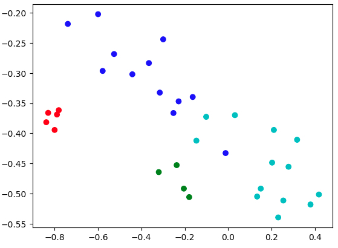

# Spelled-Out-Intro-to-Graph-Convolution-Networks

This repository is the implementation of the paper [SEMI-SUPERVISED CLASSIFICATION WITH GRAPH CONVOLUTIONAL NETWORKS](https://arxiv.org/abs/1609.02907) by Kipf et al., ICLR 2017. 

I've aimed to create a notebook that's easy to understand. It begins with a simple graph, explaining the GCN formula step by step. I implemented the GCN model using [PyTorch](https://pytorch.org) (without relying on specific graph libraries like [PyTorch Geometric](https://pytorch-geometric.readthedocs.io/en/latest/), [DGL](https://www.dgl.ai), etc.) on the Cora dataset. Additionally, I replicated a section of the paper called "Node Embeddings With Random Weights" using the Zachary Karate Club dataset. The goal was to demonstrate how GCN can be a powerful tool for extracting features from nodes in a graph. You can check out the results in the figure below.

Going ahead, I have also implemented all the variants of the GCN mentioned in the paper which are:
- Single Parameter Model
- 1st Order term only
- 1st order model
- Chebyshev Polynomials for k = 2
- MLP

## References
1. Blog by Thomas Kipf (Author of the paper) - https://tkipf.github.io/graph-convolutional-networks/
2. A great post by Matthew Bernstein on GCN - https://mbernste.github.io/posts/gcn/
3. A critical post by Ferenc Huszár - https://www.inference.vc/how-powerful-are-graph-convolutions-review-of-kipf-welling-2016-2/
4. Understanding GNNs (Distill pub post 🙏) - https://distill.pub/2021/gnn-intro/, https://distill.pub/2021/understanding-gnns/
5. Code by the author - https://github.com/tkipf/gcn
6. Geometric Deep Learning Course - https://geometricdeeplearning.com/lectures/
7. A Medium post explaining the math behind Spectral Graph Convolutions - https://medium.com/@jlcastrog99/spectral-graph-convolutions-c7241af4d8e2
8. https://www.topbots.com/graph-convolutional-networks/
9. Lectures on Spectral Graph Theory by Fan R. K. Chung - https://mathweb.ucsd.edu/~fan/research/cbms.pdf
